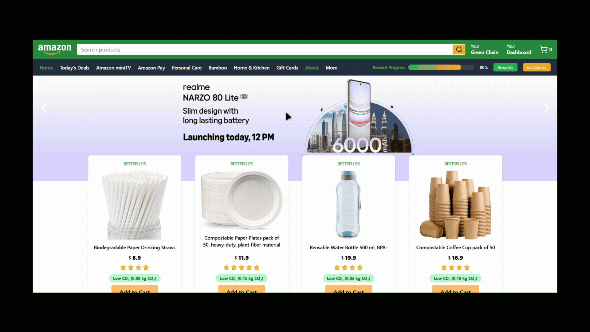

# EcoCart – HackOn with Amazon Season 5 Submission

## Team: Runtime Terror

**Team Members**  
- Yasharth Shukla  
- Tejash Kapoor  
- Abhinav Saha  

---

## Live Demo  
🔗 [EcoCart Website](https://eco-cart-pi.vercel.app/)

---

## Video Demo of the Prototype
🔗 [Demo Video](https://drive.google.com/file/d/10N0e0z3ZNVQxqxoUmzpsse20Ti0BApDQ/view?usp=sharing)

---

## Idea Submission PDF  
🔗 [View our original idea submission (PDF)](https://drive.google.com/file/d/1sw9AFPz0XeTjs_cmt93rNBbQG9yb8vQy/view?usp=sharing)

---

## Overview

**EcoCart** is a sustainable shopping assistant designed to integrate seamlessly with the Amazon shopping experience. It helps users make climate-conscious decisions by showing real-time carbon footprints, suggesting greener alternatives, and promoting group-based sustainability.

EcoCart aims to **bridge the intent–action gap** in eco-friendly shopping using **gamification**, **behavioral nudges**, and **visual insights** — all while making the experience fun, social, and engaging.

---

## Key Features

- **Smart Cart with Eco Impact**  
  See your cart’s carbon footprint in real-time and explore eco-friendly product suggestions.

- **Packaging Optimization**  
  Group products to reduce shipping waste and emissions based on simulated warehouse data.

- **Personal Impact Dashboard**  
  View your carbon savings, quest progress, and level up.

- **Green Chain**  
  Form eco-conscious groups with friends/family to complete group quests and save together.

- **Eco Score with Breakdown**  
  Products are rated based on Recycle, Reuse, and Resale parameters to help users make better choices.

- **Gamified EcoQuests**  
  Complete weekly challenges, earn EcoPoints, unlock badges, and track your streak.

- **Donation Rounding**  
  Round up your cart total to contribute to verified green initiatives like tree planting or ocean cleanup.

- **Eco Reward System**  
  Claim rewards like seed kits as you progress through eco quests and grow your personal green impact.

---

## Feature Showcase (Autoplay GIFs)

### 1️⃣ EcoCart Launch Button  
Our all new EcoCart houses all the eco friendly alternatives to the products you see on the home pages. Your one and only stop for all your eco friendly needs.

### 2️⃣ Personal Dashboard  
Track your progress, achievements and impact that you made by shopping sustainably.

### 3️⃣ Green Chain & CO₂ Group Savings  
Add friends to your eco chain and work together to make a world a better place while completing quests like a Eco-Hero party. 

### 4️⃣ Gamified EcoQuests + Reward Claim 
If there are quests there must be rewards. You help save the planet like a hero and get rewarded for it. (eco-friendly rewards)

### 5️⃣ Eco Alternative Suggestions  
Why buy something that hurts this beautiful planet that we live in. Check out the far better eco alternative that fulfuil your needs while being sustainable.

### 6️⃣ Smart Packaging + Round-Up for Donations 
Optimize your delivery experience to your liking and maybe offer up some donations. (truly a win win situation)

### 7️⃣ ♻️ Eco Score with 3Rs Breakdown  
See how a product scores on the 3R principle higher the score the better that product for the enviornment.

---

## Tech Stack

| Layer          | Tools Used                    |
|----------------|-------------------------------|
| Frontend       | React, Tailwind CSS, Vite     |
| State Mgmt     | Zustand                       |
| Charts         | Recharts                      |
| Routing        | React Router DOM              |
| Deployment     | Vercel                        |

---

## Next Steps (Beyond Prototype)
- Integration with real Amazon API (for dynamic product data).
- Backend logic to persist user progress, reward tracking, and CO₂ history.
- Advanced recommendation engine using LLMs for sustainability suggestions.
- Mobile responsiveness and PWA support.

---

